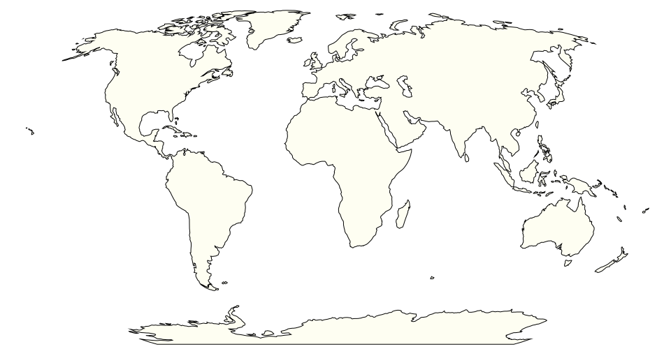
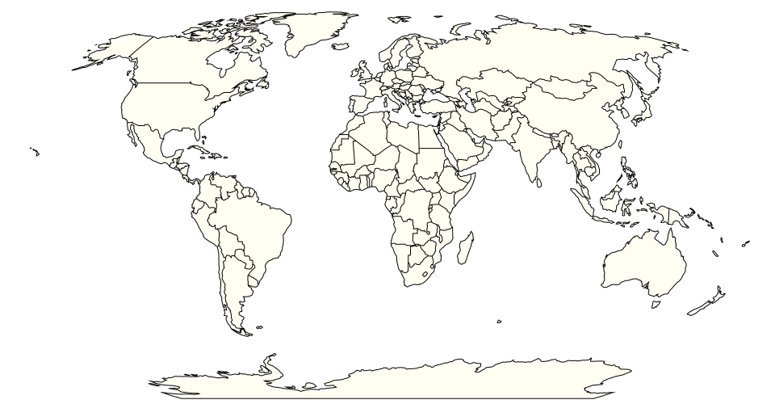

## Natural Earth vector data, modified & simplified

A modification of [topojson/world-atlas](https://github.com/topojson/world-atlas) 110m and 50m files, with various modifications intended for Visionscarto:
- fixes topology issues (border of Sudan; North Korea…)
- adds a few shapes (Kuril Islands; Gaza)
- better reflects the UN views (Ukraine; Western Sahara)
- adds names and ids (Norway; Kosovo; North Macedonia…)
- adds 3-letter codes (as properties.a3)
- quantized and optimized

## Usage

Consume these files with TopoJSON:

```{javascript}
const world = await fetch("https://cdn.jsdelivr.net/npm/visionscarto-world-atlas@0.1.0/world/110m.json").then(d => d.json());
const features = topojson.feature(world, world.objects.countries);
```

```{javascript}
const world = await fetch("https://cdn.jsdelivr.net/npm/visionscarto-world-atlas@0.1.0/world/50m.json").then(d => d.json());
const land = topojson.feature(world, world.objects.land);
```






## Credits

The hard work has been done by the team
at [Natural Earth](https://www.naturalearthdata.com/).

Mike Bostock has contributed all the necessary tooling
and examples in [world-atlas](https://github.com/topojson/world-atlas).
